# De un Excel de finanzas a una aplicación web

## Resumen

Mis finanzas es una primera versión interactiva de una aplicación personal para registrar operaciones y consultar saldos diarios. Reúne en tres vistas un flujo que antes ocupaba diez pestañas de Excel. Prioriza listas, tarjetas de indicadores y un calendario, con una interfaz oscura inspirada en iOS y consistente con el portfolio de Andrés.

**Estado:** integración con Supabase conectada. El propietario confirmó inicio de sesión, guardado tras recarga y lectura desde dos navegadores. Publicada en GitHub Pages; las pruebas de aislamiento y concurrencia siguen pendientes. Las capturas contienen datos ficticios; no se ha importado el Excel.

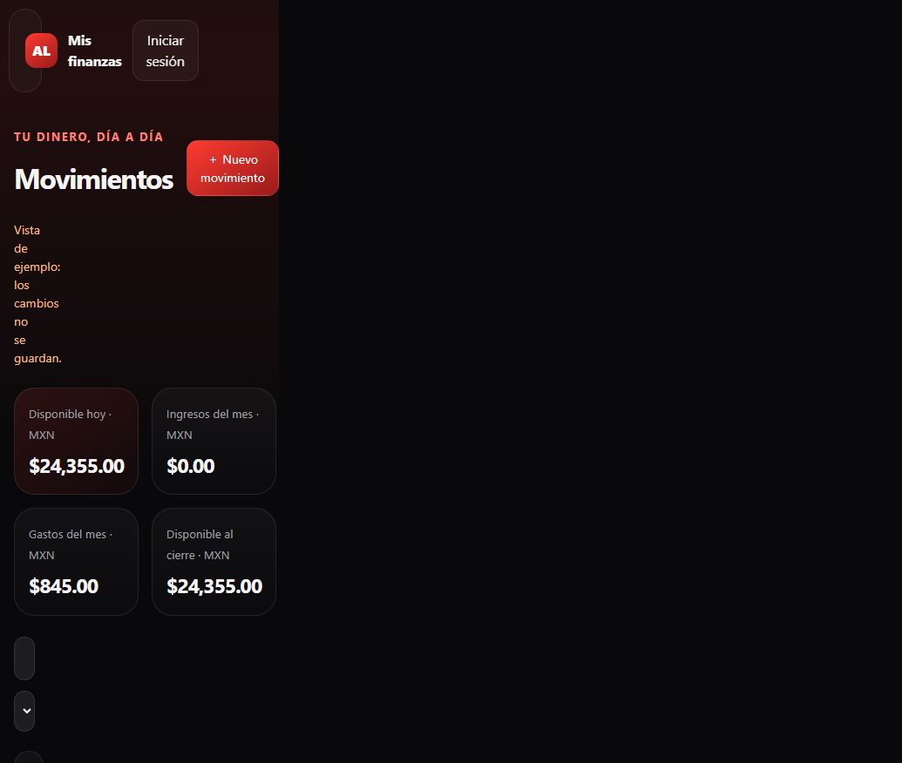

## El problema

Una hoja de cálculo permite personalizar los registros y proyectar saldos, pero requiere navegar entre varias pestañas, mantener fórmulas y usar códigos de cuenta. El objetivo de esta aplicación es conservar esa lógica con formularios adaptados a cada operación y una experiencia utilizable desde computadora y celular.

La solución organiza el trabajo en:

| Vista | Pregunta que responde |
| --- | --- |
| Movimientos | ¿Qué recibí, gasté, transferí o tengo que pagar? |
| Calendario y saldos | ¿Qué ocurrirá en una fecha y cuánto quedará en cada cuenta? |
| Configuración | ¿Qué cuentas, fechas de pago y compromisos uso? |

## Dirección visual

Se recuperaron los colores del portfolio original: fondo `#09090b`, texto `#f5f5f7`, texto secundario `#a1a1aa` y acentos `#ff3b30` y `#991b1b`. Las superficies translúcidas, bordes suaves y tipografía del sistema mantienen continuidad entre los dos proyectos.

```css
:root {
  --bg: #09090b;
  --text: #f5f5f7;
  --muted: #a1a1aa;
  --red: #ff3b30;
  --red2: #991b1b;
}
```

En escritorio, el calendario y los saldos comparten la pantalla. En móvil se apilan y la navegación permanece en la parte inferior.

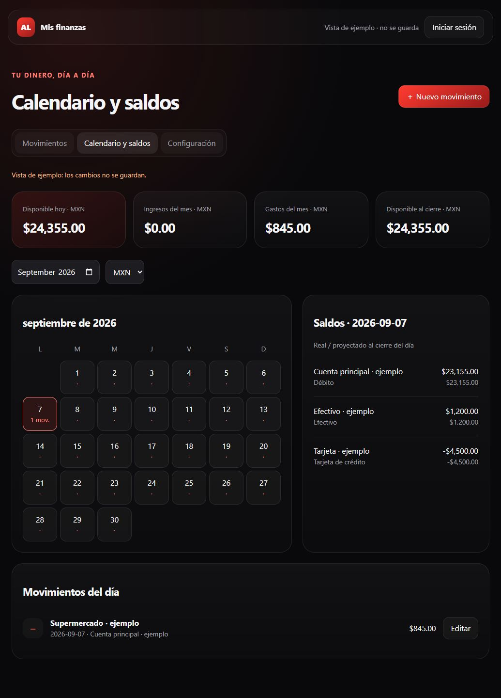

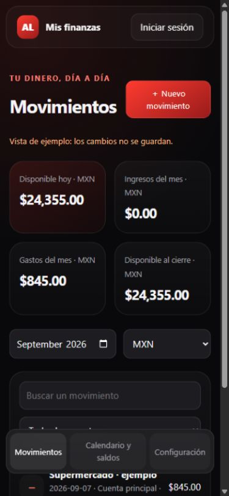

## Arquitectura y fuentes de datos

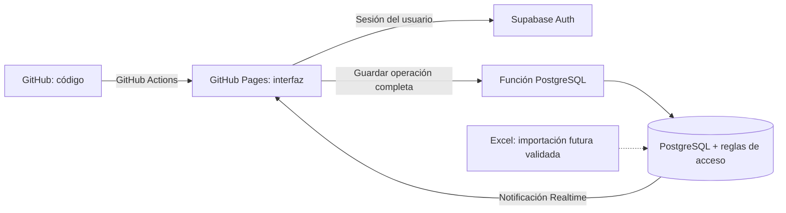

GitHub guarda únicamente el código y la documentación pública. Registrar una operación no genera un commit ni vuelve a publicar la web. La app autenticada llama a Supabase, guarda los datos y vuelve a presentar los resultados.

El Excel será una fuente inicial, no una segunda copia activa. La importación queda pendiente de conciliación. Se excluye la pestaña de nóminas y los costos recurrentes requieren validación del propietario.

### Modelo implementado en esta versión

La base usa una tabla `finance_books` con un documento JSONB por usuario. Contiene tres colecciones: cuentas, movimientos y reglas recurrentes. Cada movimiento tiene un identificador estable y los pagos derivados conservan una referencia a su compra o regla.

Esta decisión permite guardar una transferencia o un plan completo en una sola transacción y reducir el trabajo inicial. Su contrapartida es que cada guardado envía el documento entero. La versión limita el documento a 5 MB; para mayor volumen, el siguiente paso es normalizar cuentas, movimientos y cuotas en tablas relacionadas. No debe confundirse este diseño con un JSON público en el repositorio.

```json
{
  "id": "movimiento-unico",
  "kind": "transfer",
  "from": "cuenta-debito",
  "to": "efectivo",
  "amount": 50000,
  "received": 50000,
  "date": "2026-09-07",
  "status": "done"
}
```

Los importes se almacenan en centavos: `50000` representa $500.00. MXN y CAD se muestran por separado; una transferencia entre monedas guarda ambos importes sin recalcular el historial con un tipo de cambio nuevo.

## Reglas financieras

**Transferencias:** una salida de débito y una entrada a efectivo pertenecen al mismo movimiento. No son un gasto ni un ingreso. El saldo total se conserva cuando ambas cuentas usan la misma moneda.

**Pagos:** una operación reduce la cuenta de origen y aumenta el saldo de la cuenta de deuda, que se representa con signo negativo. Pagar una compra no registra el gasto por segunda vez.

**Estados:** el saldo real usa operaciones realizadas; la proyección incluye también las pendientes hasta la fecha elegida. La fecha programada no confirma que un banco haya ejecutado un pago.

**MSI:** la compra aumenta la deuda total y genera cuotas futuras. Las cuotas se guardan junto con la compra. Las diferencias de redondeo quedan en la última cuota.

```javascript
const base = Math.floor(totalCentavos / mensualidades);
const cuotas = Array.from({ length: mensualidades }, (_, i) => (
  base + (i === mensualidades - 1
    ? totalCentavos - base * mensualidades
    : 0)
));
// $100.00 en 3 pagos: [3333, 3333, 3334] centavos.
```

El calendario ajusta un pago del día 31 al último día de un mes corto y conserva el día original para los meses siguientes. La primera fecha sugerida se puede corregir según el estado de cuenta.

## Privacidad y edición concurrente

La clave pública identifica el proyecto; no otorga acceso a registros ajenos. La tabla usa Row Level Security para lectura. Las escrituras pasan por una función que toma la identidad de la sesión, no un identificador de usuario enviado por la interfaz.

```sql
create policy owner_read on public.finance_books
for select to authenticated
using ((select auth.uid()) = user_id);
```

Cada guardado incluye la revisión que leyó el dispositivo. Si otro dispositivo guardó antes, la operación se rechaza en lugar de sobrescribir silenciosamente sus cambios.

```sql
update public.finance_books
set payload = p_payload,
    revision = revision + 1,
    updated_at = now()
where user_id = auth.uid()
  and revision = p_revision;
-- Si no se actualiza una fila, la función devuelve un conflicto.
```

El cliente está preparado para suscribirse a cambios de su propio registro mediante Supabase Realtime. Esta parte requiere probarse con el proyecto configurado y sesiones reales; una captura de la interfaz no demuestra sincronización.

## Validación realizada

- Verificación de sintaxis JavaScript y respuesta HTTP de la vista local.
- Pruebas del cálculo de cuotas, ajuste final de centavos, fin de mes y año bisiesto.
- Pruebas de saldo realizado frente a proyectado y conservación del saldo en una transferencia.
- Capturas de las vistas de escritorio y móvil con datos ficticios.

## Trabajo pendiente

- Probar aislamiento entre usuarios y concurrencia simultánea.
- Registro manual de gastos programados e ingresos aproximados, a cargo del propietario.
- Importar el historial después de validar cuentas, saldos y pagos para evitar duplicados.
- Ampliar las pruebas de aislamiento entre usuarios y los flujos de recuperación de acceso.
- Conciliar cuotas MSI con pagos globales ya programados y permitir reestructurar planes.
- Agregar restauración del respaldo exportado.

## Aprendizajes del proyecto

El reto central fue trasladar la lógica de una hoja de cálculo a operaciones explícitas: distinguir compras de pagos, separar saldo real de proyección y mantener ambas partes de una transferencia juntas. La estética ayuda a reducir fricción, pero la consistencia de los registros es la base de una herramienta financiera útil.

## Referencias

- [Portfolio original](https://andreslg99.github.io/andres-portfolio/)
- [Repositorio del proyecto](https://github.com/AndresLG99/personal_finance_app)
- [GitHub Pages](https://docs.github.com/en/pages)
- [Supabase Row Level Security](https://supabase.com/docs/guides/database/postgres/row-level-security)
- [Supabase Realtime](https://supabase.com/docs/guides/realtime/postgres-changes)

La app es un proyecto personal desarrollado con asistencia de IA. No ejecuta operaciones bancarias ni ofrece asesoría financiera.

## Actualización: organización y recurrencias

Los movimientos se ordenan por fecha ascendente. Cada registro admite categoría y negocio opcionales, además de concepto; estos campos también participan en la búsqueda. Las reglas permiten repetir cada X días, semanas, meses o años y definir el número total de pagos. Se conserva el día original en recurrencias mensuales cuando un mes corto obliga a ajustar la fecha. Los movimientos ya existentes no se modifican.

## Actualización del 12 de septiembre de 2026

Movimientos separa realizados (fecha descendente) y pendientes (fecha ascendente), ambos limitados al mes seleccionado. La confirmación conserva la fecha programada original y permite cambiar la fecha efectiva y notas sin modificar otras cuotas. Al editar un pendiente de una recurrencia se puede aplicar la información a los siguientes pendientes; las fechas de esos siguientes pagos se conservan y se respetan las excepciones individuales.

Las categorías se seleccionan de un catálogo inicial y de las categorías históricas ya existentes para conservar compatibilidad. No se crean desde un campo libre. Los negocios ofrecen sugerencias del historial y permiten nombres nuevos.

Calendario y Saldos coloca Movimientos del día junto al calendario y Saldos debajo, con fecha larga. Los movimientos son de consulta y muestran el saldo proyectado después de cada operación. Para empates de fecha se usa el orden existente de los registros, ya que no se captura hora. El formulario de nóminas permite guardar el líquido bancario y completar el desglose después.

## Nómina detallada y lectura de importes

La nómina se registra en tres pestañas: Percepciones, Deducciones e Informativos. Cada concepto conserva fecha, empresa, código y monto. Los días 1–15 corresponden a la primera quincena y 16–fin de mes a la segunda. Un recibo agrupa una empresa y una quincena.

```js
const neto = percepciones - deducciones;
// Los informativos no se suman al neto.
// Los vales son informativos y no crean movimientos automáticos.
```

Las sugerencias personales se importan al espacio privado del usuario en Supabase, sin publicar salarios ni conceptos privados en GitHub. Los importes fijos se proponen como valores editables; los variables requieren capturar el monto real. El detalle queda disponible en Configuración. Cada depósito puede confirmarse desde Movimientos.

Los saldos positivos e ingresos se muestran en verde; saldos negativos, gastos y pagos en rojo; transferencias entre cuentas en gris. Los signos complementan el color. Las verificaciones cubren los límites de quincena, cálculo en centavos y exclusión de informativos del neto.

### Depósito primero, desglose después

El usuario puede registrar únicamente empresa, fecha, cuenta y neto bancario. Más adelante abre «Completar o editar desglose» en Configuración. El depósito conserva su identificador: completar conceptos no duplica ingresos. Los vales forman parte del registro informativo; no generan depósitos automáticos.

```js
const diferencia = netoBancario - (percepciones - deducciones);
```

Sin conceptos se muestra «Desglose pendiente». Con conceptos se informa coincidencia o diferencia positiva/negativa, calculada en centavos. Una diferencia no impide guardar un desglose parcial. Se verificaron depósito sin conceptos, edición posterior, identificadores estables y exclusión de vales del neto.


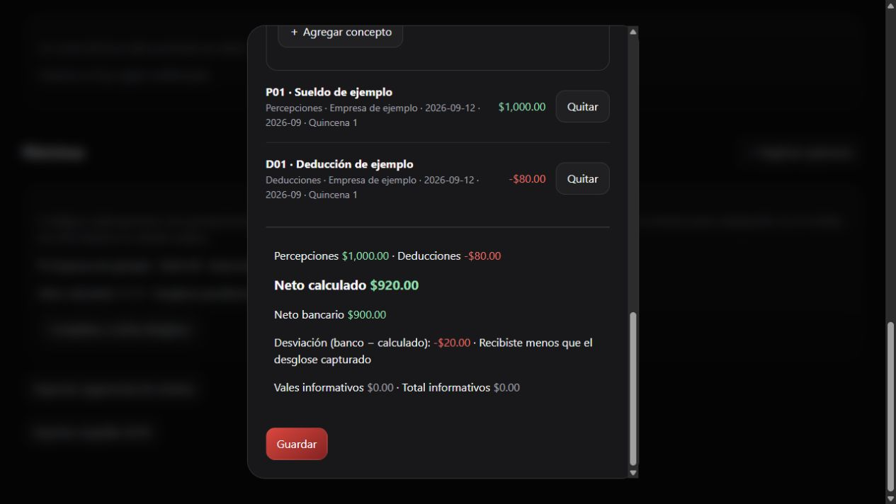

### Edición y eliminación

Movimientos permite eliminar registros tras revisar el concepto, la fecha y el monto en una confirmación. Los saldos se recalculan. Al borrar el depósito de una nómina se elimina también su desglose asociado; otros depósitos históricos se conservan.

En Costos recurrentes, Editar actualiza el calendario pendiente y conserva los movimientos realizados y las excepciones individuales. Las fechas eliminadas no se regeneran. Eliminar permite elegir entre cancelar los pendientes o conservarlos como movimientos independientes.

### Prueba familiar

Cada familiar necesita su propio usuario de Supabase Authentication. El documento financiero usa `auth.uid()` para leer y guardar exclusivamente el registro del usuario autenticado. La interfaz actual incluye inicio de sesión; los usuarios se pueden crear desde Authentication → Users en el proyecto Supabase. No hay registro público en la app. Las pruebas completas de aislamiento entre dos cuentas reales siguen pendientes.


## Catálogo fijo e importación de programaciones

El catálogo se ordena alfabéticamente en español, con Sin Categoria, Otros Ingresos y Otros al final. Al cargar la cuenta se unifican las categorías de movimientos y reglas existentes: Subscriptions → Suscripciones, Phone → Telefono, Medicos → Médicos y Comida → Alimentación. Hormiga permanece en la lista fija. Esta migración conserva fechas, importes e identificadores y se guarda en Supabase con control de revisión.

Configuración ofrece Descargar plantilla CSV y Cargar CSV. La importación muestra una vista previa y se confirma antes de guardar. Omite fechas anteriores a la fecha local actual; incluye hoy y fechas futuras sin límite de año. El filtro mensual de Movimientos continúa aplicándose a la visualización.

```csv
id,fecha,tipo,concepto,cuenta_origen,cuenta_destino,monto,categoria,negocio,notas,monto_recibido
pago-001,2031-01-22,pago,Pago tarjeta,Mi banco,Mi tarjeta,1500.00,Pago de tarjeta,,,
```

- Obligatorios: fecha, tipo, concepto y monto; las cuentas dependen del tipo.
- Tipos: pago, gasto, ingreso, transferencia. Todos se importan pendientes, incluso si hay columnas adicionales de estado.
- Fechas: AAAA-MM-DD o DD/MM/AAAA. Importes positivos con hasta dos decimales. Se aceptan coma o punto y coma como delimitador y celdas entre comillas.
- Pago o transferencia requiere origen y destino; gasto solo origen; ingreso solo destino. Las cuentas deben existir, estar activas y coincidir por nombre o identificador.
- El ID externo es opcional. Los IDs repetidos con datos diferentes se rechazan. Las coincidencias de fecha, tipo, cuentas, monto y concepto se omiten para evitar duplicados, incluso frente a movimientos confirmados.
- Si una fila vigente tiene errores, no se importa el archivo parcialmente. Se muestran los primeros 30 errores. La vista previa muestra hasta 100 movimientos; al confirmar se procesan todas las filas válidas.
- No hay límite de año; el archivo individual debe pesar menos de 4.5 MB y el registro financiero debe respetar el límite del documento en Supabase.

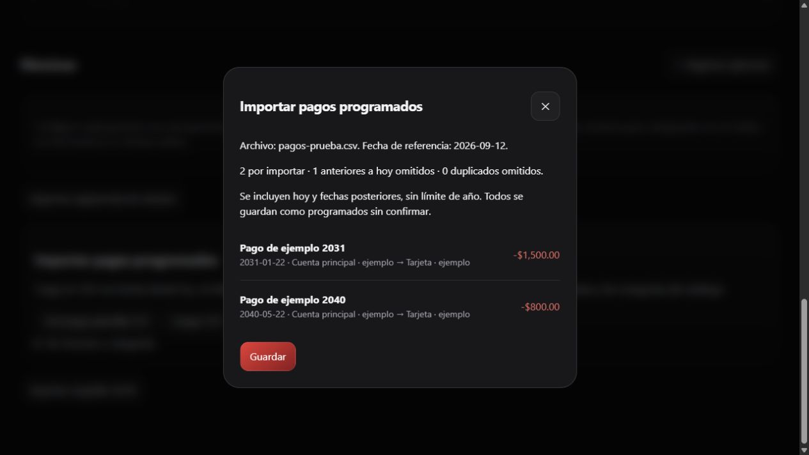

Pruebas: migración repetible, orden fijo, exclusión del pasado, inclusión de hoy y 2040, fechas imposibles, montos, delimitadores, comillas, cuentas, categorías e importaciones duplicadas. También se verificó la aparición de un pago de 2040 en Movimientos en un entorno de ejemplo.


## Insights y captura de importes

Insights reúne dinero disponible, deuda actual, pendientes y vencidos, separados por moneda. Una gráfica de barras resume las seis principales categorías de gasto realizado. Los botones de cuentas abren el historial completo, sin filtro mensual, y una gráfica del saldo proyectado.

Cada fila muestra el movimiento, saldo realizado y saldo proyectado desde el saldo inicial. Los movimientos previos a la fecha inicial se conservan visibles sin un saldo reconstruido. En celular las filas se presentan como tarjetas para evitar desplazamiento horizontal.

La proyección de liquidación recorre cargos y pagos registrados; no atribuye intereses desconocidos. Si un cargo posterior vuelve a dejar deuda, no presenta una liquidación anterior como definitiva. Cuando los pagos no cubren la deuda, muestra el faltante. Los pendientes vencidos se proyectan para hoy y se identifican como tales. Las cuentas de préstamos por cobrar usan el sentido inverso del saldo para estimar la fecha de cobro.

```js
const cambio = (movimiento.to === cuenta ? importeRecibido : 0)
             - (movimiento.from === cuenta ? importe : 0);
// Realizado: solo movimientos confirmados.
// Proyectado: incluye también los programados.
```

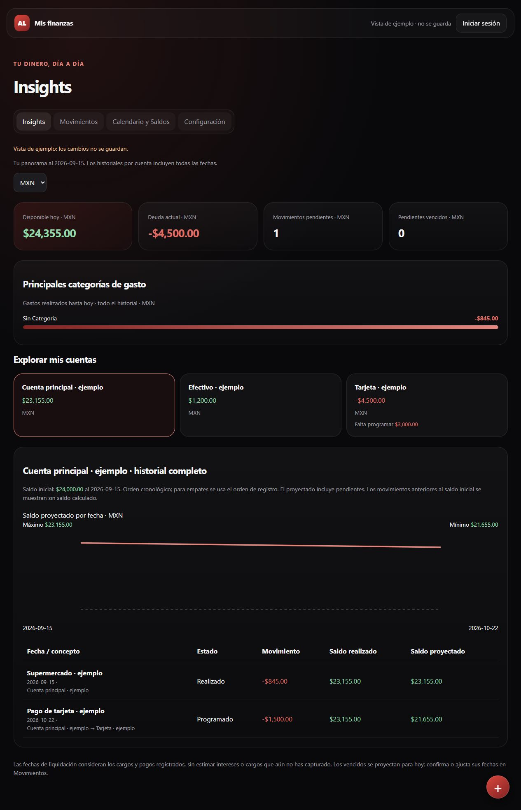

Duplicar abre un formulario con la fecha local de hoy y copia los datos descriptivos, cuentas, importes y estado. La copia solo se guarda al confirmar el formulario. No hereda identificadores ni vínculos con reglas, importaciones o nóminas. Duplicar una compra MSI permite definir un nuevo plan.

Los campos monetarios usan teclado decimal y separadores de miles durante la captura, con dos decimales al terminar. El valor numérico se conserva por separado del texto formateado para cálculos y guardado. El botón Calcular abre un teclado con suma, resta, multiplicación, división y paréntesis. El evaluador admite únicamente aritmética, aplica precedencia y redondea a centavos; no ejecuta código.

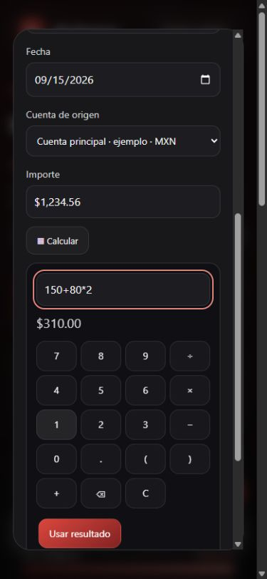

El botón flotante «+» permite abrir Nuevo movimiento desde cualquier sección. Tiene nombre accesible y se ubica por encima de la navegación móvil. Se verificaron cálculos financieros, duplicación independiente, cuentas por cobrar, deudas reabiertas, vencidos, captura formateada, guardado de una copia y distribución a 390 px de ancho. El teclado nativo depende del dispositivo; la vista móvil se comprobó mediante una ventana de prueba, sin un teléfono físico.


Los movimientos programados del historial por cuenta en Insights incluyen Modificar. Abre el mismo formulario de edición de Movimientos y, al guardar, actualiza los saldos y la proyección en la cuenta seleccionada. Los realizados siguen como consulta en Insights.


### Acciones compactas y conversión entre monedas
Los historiales de Insights ofrecen modificar pendientes, duplicar y eliminar mediante iconos accesibles. En celular las acciones se encuentran sobre el concepto y fuera de la fila de estado. Movimientos utiliza los mismos iconos; eliminar conserva su diálogo de confirmación.

Para pagos y transferencias entre monedas, se puede capturar el importe de origen o destino. La app consulta Frankfurter v2 (https://frankfurter.dev/), sin claves ni envío de importes o datos de cuentas. Solo envía monedas y fecha. Las referencias no son cotizaciones bancarias: se muestra su fecha efectiva y puede corresponder al último día disponible.

Los pendientes se recalculan al abrir y cada hora mientras la app está abierta. La conversión conserva el lado capturado y redondea el otro a centavos. No requiere un proceso de servidor ni republicar Pages. Al guardar un realizado se conserva la tasa de su fecha o la tasa/importes manuales. Los realizados existentes conservan sus valores. Si la consulta falla, se conservan las estimaciones anteriores y se informa; un nuevo realizado puede guardarse con tasa manual.

```js
// Importes en centavos; FX permanece dentro del registro del usuario.
transaction.fx = { mode: 'auto', anchor: 'from', rate: 13.2,
  rateDate: '2026-09-15', fixed: true };
// Solo los pendientes se actualizan automáticamente.
if (transaction.status === 'pending') refreshPending(book);
```

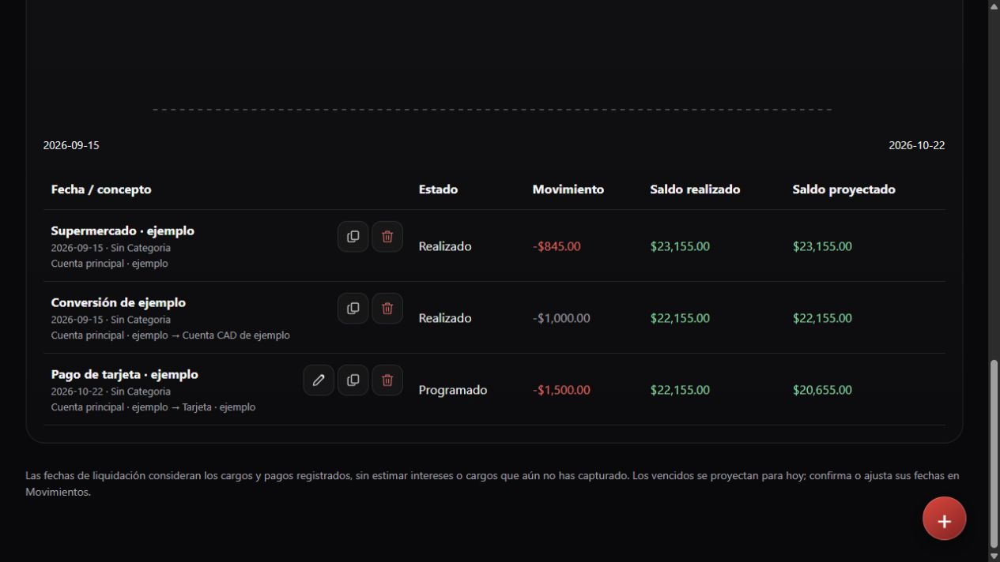


### Cuentas agrupadas y registro personal
Insights y Configuración agrupan las cuentas en tres bloques: débito/efectivo/ahorro/vales, tarjetas/deudas, y préstamos por cobrar. Cada bloque usa un encabezado discreto y una línea tenue; solo aparecen los grupos que tienen cuentas. El orden no modifica los registros ni los saldos.

El diálogo de acceso permite pasar a Crear cuenta, captura correo y contraseña con confirmación y utiliza Supabase Auth. El nuevo usuario empieza con un documento vacío; la política de lectura y la función de guardado siguen usando auth.uid().

```js
await client.auth.signUp({
  email, password,
  options: { emailRedirectTo: new URL('./', location.href).href }
});
```

Configuración requerida en Supabase: permitir altas por correo; configurar la URL pública https://andreslg99.github.io/personal_finance_app/ como Site URL y redirect permitido. Si la confirmación de correo está activa, se necesita un proveedor SMTP para enviar a personas fuera del equipo de Supabase (https://supabase.com/docs/guides/auth/auth-smtp). La UI muestra los errores de configuración sin registrar datos financieros de otro usuario. No se ha probado aún un alta real de principio a fin ni el aislamiento con dos cuentas reales. Estas verificaciones requieren acceso al panel y correos de prueba autorizados.

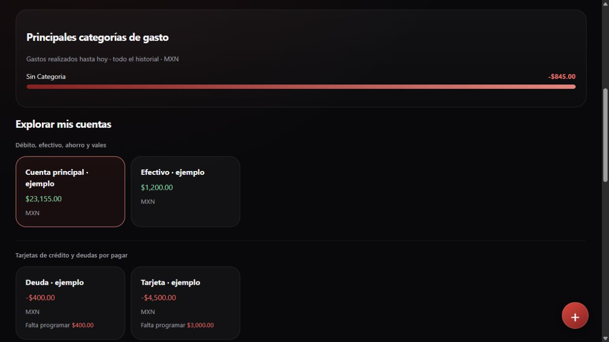

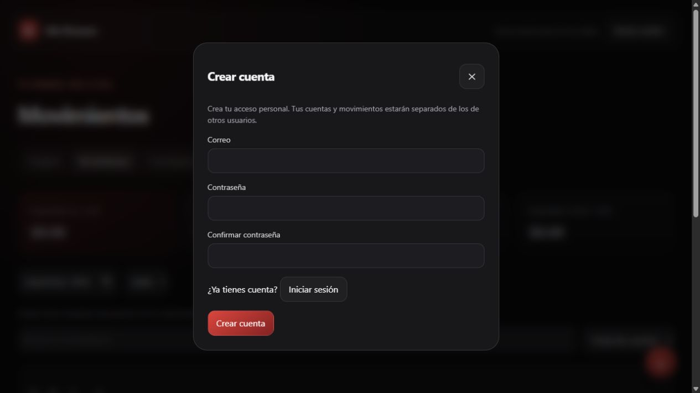


### Timeline de los próximos 30 días
La gráfica por cuenta utiliza dos extremos fijos: fecha local actual y 30 días después. Muestra el saldo proyectado al cierre de cada día; los cambios aparecen como escalones en la fecha correspondiente. Las fechas de pago, corte y movimientos programados se señalan con líneas verticales numeradas y descripciones con importes encima de la gráfica. Los eventos del mismo día se agrupan. Los días 29–31 se ajustan al último día de los meses cortos. La tabla conserva todo el historial.

```js
const end = addDays(today(), 30);
const projected = balance(state, account.id, date, true);
// Las fechas de corte y vencimiento son recordatorios: no generan cargos.
```

La gráfica permite desplazamiento horizontal en móvil para conservar la legibilidad y ofrece los 31 saldos diarios en una lista desplegable. Las pruebas cubren extremos del intervalo, febrero y año bisiesto, saldo inicial futuro, aislamiento por cuenta e importes destino en otra moneda.

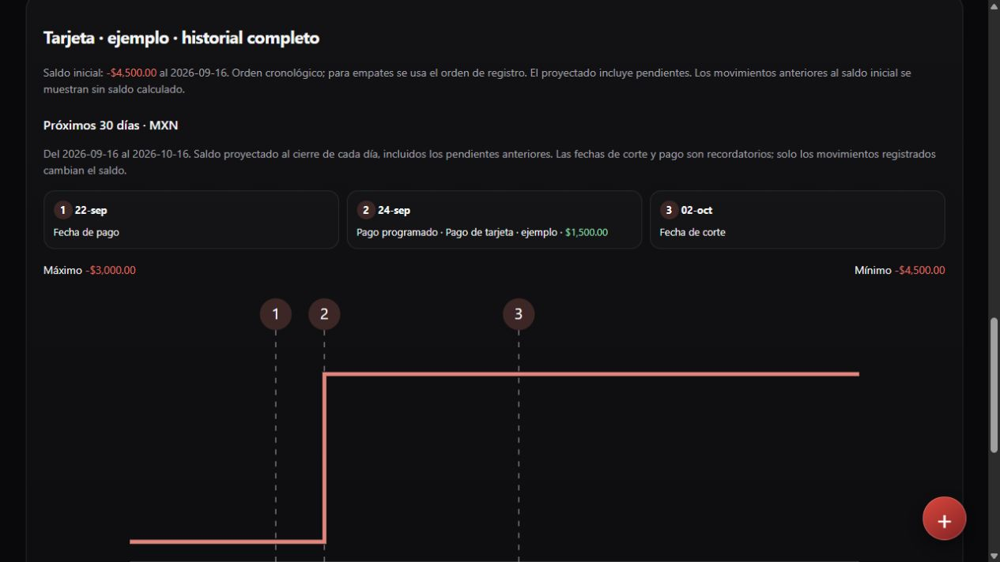

Correo: se eligió Brevo Free como opción de envío (300 envíos diarios según su documentación al revisar). Queda pendiente la creación/verificación de la cuenta por el propietario y conexión de sus credenciales SMTP en Supabase. No se guardan claves en el repositorio. La URL pública de retorno ya fue configurada en Supabase.


## Bienvenida y consulta diaria
La guía de seis pasos se abre al cargar una cuenta autenticada sin registros y sin una bienvenida completada u omitida. Puede repetirse desde Configuración. Su estado se guarda en el documento privado del usuario y se sincroniza entre dispositivos.

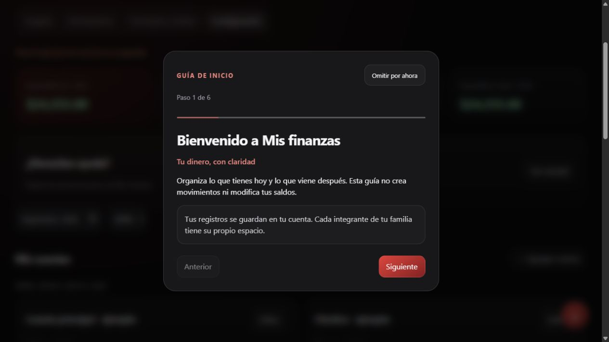

Insights es la pantalla inicial. Su historial completo conserva todas las fechas, separado en realizados descendentes y programados ascendentes. Movimientos muestra realizados de hoy y programados entre hoy y hoy + 30 días, inclusive. Los vencidos se consultan en Insights.

```js
// La edición conserva la hora del registro inicial.
if (previous.createdAt) transaction.createdAt = previous.createdAt;
// El orden de visualización no cambia el cálculo cronológico de los saldos.
```

La fecha de la operación es el primer criterio; la hora de creación resuelve el orden dentro del día. Los registros históricos sin hora conservan su orden de inserción. Duplicar crea una nueva hora de registro. Pruebas: límites de 30 días, exclusión de ayer, orden por hora, conservación al editar y elegibilidad de bienvenida.


## Cuentas con estilo Wallet
Las cuentas conservan su información y agrupación, con superficies de tarjeta, degradados por institución reconocida o tipo de cuenta, y selección visible en Insights. En móvil se presentan en una columna sin ocultar información. No se inventan números, CLABE ni redes de pago.

Los negocios reconocidos muestran iconos locales: Walmart, Starbucks, OXXO, 7-Eleven, Amazon, Netflix, Spotify, Uber, Apple, Costco y McDonald's. Se usa el negocio registrado; si está vacío, el concepto. Las demás operaciones conservan un símbolo por tipo. Los iconos se obtuvieron del servicio público de favicons de Google usando los dominios de las marcas y se incorporaron a merchant-icons.js; la app no consulta servicios de logos durante su uso. Marcas e iconos pertenecen a sus respectivos titulares.

```js
const theme = walletTheme(account);
const icon = merchantIcon(transaction);
```

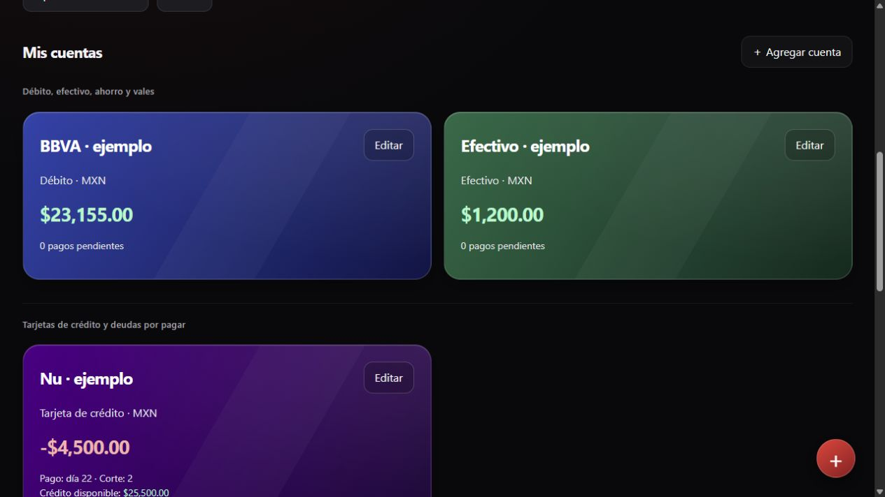


## Ajustes de acceso y uso — 22 de septiembre de 2026
- Contraseñas con botón de visibilidad en ingreso y registro, incluida confirmación.
- Ingresos recurrentes independientes de nómina. Se generan como pendientes hacia la cuenta destino y se preservan las ocurrencias realizadas o ajustadas al editar la regla.
- Modelo y color elegibles por cuenta; Liverpool rosa y AMEX plateada por defecto. Insights muestra límite disponible, día de corte y pago.
- Editar, duplicar y eliminar en Movimientos, historial de Insights y movimientos del calendario. Iconos accesibles también para cuentas, recurrencias y desglose de nómina.
- Guía de ocho pasos que navega y desplaza la pantalla a la sección correspondiente. Se puede interactuar con la app mientras se consulta. Al finalizar se intenta guardar en la nube; si falla, conserva la finalización local por usuario y avisa de que no se sincronizó. Esto no representa guardado de datos financieros.
- Se verificó EXECUTE para authenticated y una llamada real a save_finance_book dentro de una transacción revertida. No se reprodujo el error original; no se cambiaron permisos. El cliente valida la sesión y reintenta una vez tras renovarla cuando recibe permiso denegado o JWT vencido.
- Los campos monetarios aceptan operaciones al salir o guardar. El modo con signos solicita el teclado estándar del sistema; el modo decimal sigue disponible. iOS decide sus teclas: inputmode no permite añadir operadores al teclado numérico nativo. Referencia: https://developer.mozilla.org/en-US/docs/Web/HTML/Reference/Global_attributes/inputmode

```js
// Un ingreso recurrente aumenta la cuenta receptora únicamente al confirmarse.
{ kind: 'income', from: null, to: rule.to, status: 'pending' }
```

Validación: regresiones financieras y pruebas de recurrencia semanal, preservación de confirmados, colores, operaciones con signo y recorrido completo del tutorial. El teclado físico de un iPhone requiere comprobación en ese dispositivo.

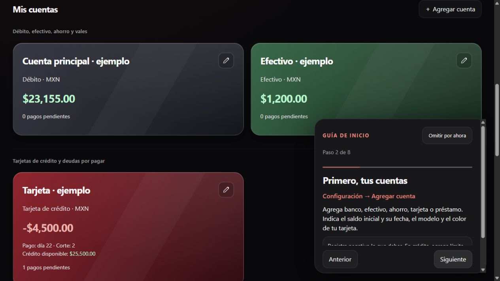


## Septiembre 2026: asignación de gastos y navegación diaria

Al guardar un gasto en una tarjeta de crédito o deuda por pagar, aparece un segundo formulario para sumarlo a un pago pendiente de esa misma cuenta. Muestra fecha, concepto e importe antes y después. El gasto ya está guardado; cerrar el aviso no lo elimina. Si no hay pagos elegibles, explica cómo crear uno. Al editar un gasto sin asignación puede retomarse este paso.

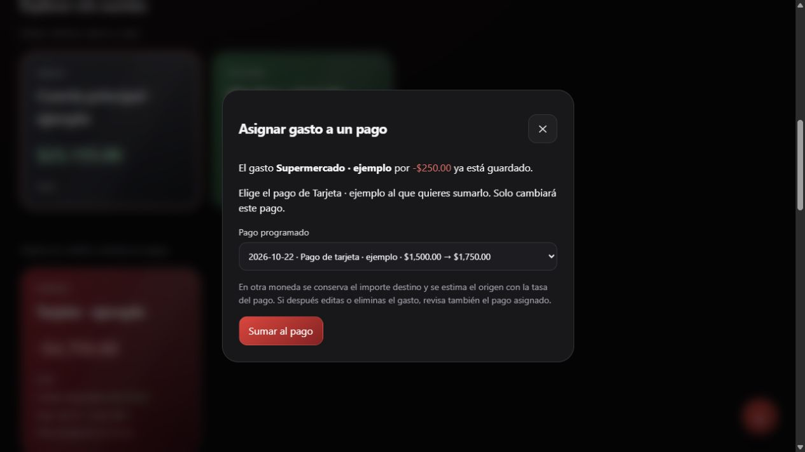

La asignación afecta solo al pago elegido, protege esa ocurrencia de regeneraciones de la recurrencia y conserva las fechas. Se registra la relación en el gasto para impedir sumarlo dos veces. En otra moneda, el importe de destino queda como referencia y el origen sigue la tasa estimada. Una edición o eliminación posterior del gasto requiere revisar su pago: se muestra esta advertencia en el formulario.

```js
const next = allocateExpense(state, expenseId, paymentId);
await persist(next); // revisión optimista del documento privado
```

Insights reúne los indicadores, las tarjetas, la gráfica de 30 días y las listas de realizados de hoy y programados de hoy a 30 días. Movimientos contiene el historial completo por cuenta, separado entre realizados y programados, con el mismo formato de filas y los saldos tras cada operación. No se aplica filtro mensual al historial. Ambos conservan modificar, duplicar, eliminar y confirmar pendientes. El tutorial señala las nuevas ubicaciones.

Volver a tocar la pestaña activa desplaza la página al inicio; también funciona en escritorio. Pruebas automatizadas: aislamiento de recurrencia, centavos, rechazo de asignaciones repetidas, pagos no elegibles, conversión entre monedas y separación de vistas. Prueba de navegador con datos ficticios: gasto de $250 que incrementa un pago de $1,500 a $1,750. No se modificaron datos financieros reales durante estas pruebas.

### Separación de listas por cuenta
Realizados y Programados se presentan como dos paneles independientes con 22 px de separación, sin una tarjeta exterior que los una. Se conserva la lógica de saldos y los registros existentes.

## Rediseño adaptable inspirado en Liquid Glass

La versión de septiembre de 2026 conserva la paleta roja y el tema oscuro, con un diseño web inspirado en los [materiales de Apple](https://developer.apple.com/design/human-interface-guidelines/materials). Es una implementación propia en HTML/CSS, no un componente nativo de iOS.

- Celular: barra inferior con iconos y texto, botones de acciones de 44 px, tarjetas y filas que se reorganizan en una columna, formularios tipo hoja inferior y respeto por las áreas seguras del dispositivo.
- Computadora: barra lateral persistente desde 1100 px, más espacio para cuentas y formularios de dos columnas.
- Tamaño intermedio: navegación superior adhesiva entre 801 y 1099 px.
- Capas: reflejo interior sutil, sombras suaves, navegación translúcida y fondo de los diálogos desenfocado. Las superficies de contenido conservan contraste para leer números.
- Accesibilidad: foco visible, pestaña actual identificada para lectores de pantalla, preferencias de movimiento reducido y alternativas para mayor contraste o menor transparencia.

```css
nav, dialog {
  backdrop-filter: blur(28px) saturate(145%);
  box-shadow: 0 20px 50px #0004, inset 0 1px 0 #ffffff15;
}
@media (prefers-reduced-motion: reduce) {
  *, *::before, *::after { animation: none !important; transition: none !important; }
}
```

El estilo adaptable se mantiene en `interface.css`, separado de los cálculos financieros. Se verificaron anchos de 320, 390, 1024 y 1440 px sin desbordamiento horizontal en las vistas revisadas; calendario en pantalla pequeña, apertura/cierre de formularios y guardado con datos ficticios. Las pruebas se hicieron en navegador Chromium con tamaños de pantalla ajustados, no en un iPhone físico: el comportamiento del teclado y Safari requiere comprobación en el dispositivo.

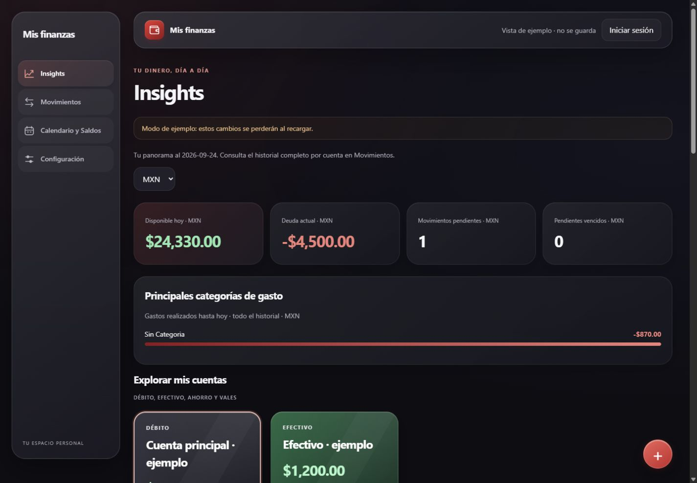

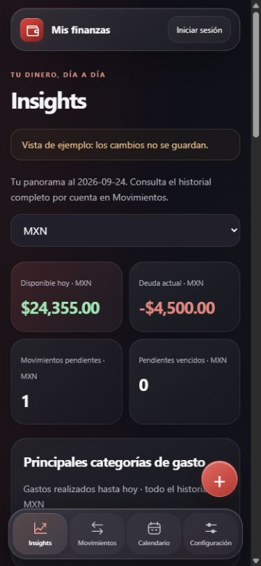

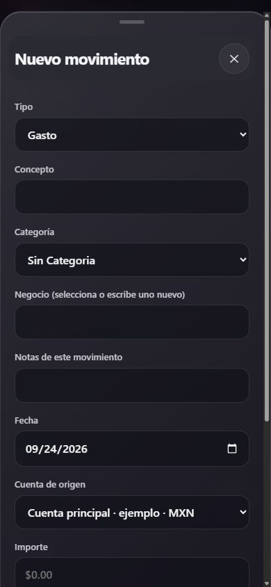
