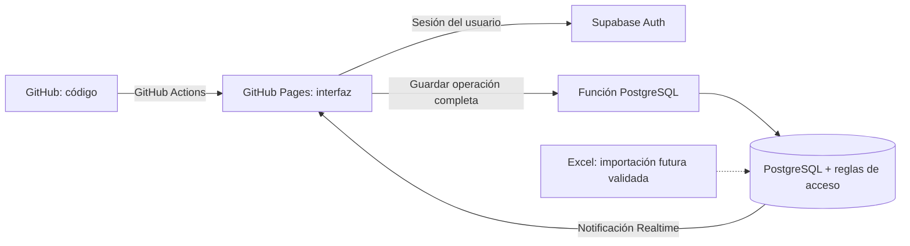

# De un Excel de finanzas a una aplicación web

## Resumen

Mis finanzas es una primera versión interactiva de una aplicación personal para registrar operaciones y consultar saldos diarios. Reúne en tres vistas un flujo que antes ocupaba diez pestañas de Excel. Prioriza listas, tarjetas de indicadores y un calendario, con una interfaz oscura inspirada en iOS y consistente con el portfolio de Andrés.

**Estado:** integración con Supabase conectada. El propietario confirmó inicio de sesión, guardado tras recarga y lectura desde dos navegadores. Publicada en GitHub Pages; las pruebas de aislamiento y concurrencia siguen pendientes. Las capturas contienen datos ficticios; no se ha importado el Excel.


## El problema

Una hoja de cálculo permite personalizar los registros y proyectar saldos, pero requiere navegar entre varias pestañas, mantener fórmulas y usar códigos de cuenta. El objetivo de esta aplicación es conservar esa lógica con formularios adaptados a cada operación y una experiencia utilizable desde computadora y celular.

La solución organiza el trabajo en:

| Vista | Pregunta que responde |
| --- | --- |
| Movimientos | ¿Qué recibí, gasté, transferí o tengo que pagar? |
| Calendario y saldos | ¿Qué ocurrirá en una fecha y cuánto quedará en cada cuenta? |
| Configuración | ¿Qué cuentas, fechas de pago y compromisos uso? |

## Dirección visual

Se recuperaron los colores del portfolio original: fondo `#09090b`, texto `#f5f5f7`, texto secundario `#a1a1aa` y acentos `#ff3b30` y `#991b1b`. Las superficies translúcidas, bordes suaves y tipografía del sistema mantienen continuidad entre los dos proyectos.

```css
:root {
  --bg: #09090b;
  --text: #f5f5f7;
  --muted: #a1a1aa;
  --red: #ff3b30;
  --red2: #991b1b;
}
```

En escritorio, el calendario y los saldos comparten la pantalla. En móvil se apilan y la navegación permanece en la parte inferior.


## Arquitectura y fuentes de datos



GitHub guarda únicamente el código y la documentación pública. Registrar una operación no genera un commit ni vuelve a publicar la web. La app autenticada llama a Supabase, guarda los datos y vuelve a presentar los resultados.

El Excel será una fuente inicial, no una segunda copia activa. La importación queda pendiente de conciliación. Se excluye la pestaña de nóminas y los costos recurrentes requieren validación del propietario.

### Modelo implementado en esta versión

La base usa una tabla `finance_books` con un documento JSONB por usuario. Contiene tres colecciones: cuentas, movimientos y reglas recurrentes. Cada movimiento tiene un identificador estable y los pagos derivados conservan una referencia a su compra o regla.

Esta decisión permite guardar una transferencia o un plan completo en una sola transacción y reducir el trabajo inicial. Su contrapartida es que cada guardado envía el documento entero. La versión limita el documento a 5 MB; para mayor volumen, el siguiente paso es normalizar cuentas, movimientos y cuotas en tablas relacionadas. No debe confundirse este diseño con un JSON público en el repositorio.

```json
{
  "id": "movimiento-unico",
  "kind": "transfer",
  "from": "cuenta-debito",
  "to": "efectivo",
  "amount": 50000,
  "received": 50000,
  "date": "2026-09-07",
  "status": "done"
}
```

Los importes se almacenan en centavos: `50000` representa $500.00. MXN y CAD se muestran por separado; una transferencia entre monedas guarda ambos importes sin recalcular el historial con un tipo de cambio nuevo.

## Reglas financieras

**Transferencias:** una salida de débito y una entrada a efectivo pertenecen al mismo movimiento. No son un gasto ni un ingreso. El saldo total se conserva cuando ambas cuentas usan la misma moneda.

**Pagos:** una operación reduce la cuenta de origen y aumenta el saldo de la cuenta de deuda, que se representa con signo negativo. Pagar una compra no registra el gasto por segunda vez.

**Estados:** el saldo real usa operaciones realizadas; la proyección incluye también las pendientes hasta la fecha elegida. La fecha programada no confirma que un banco haya ejecutado un pago.

**MSI:** la compra aumenta la deuda total y genera cuotas futuras. Las cuotas se guardan junto con la compra. Las diferencias de redondeo quedan en la última cuota.

```javascript
const base = Math.floor(totalCentavos / mensualidades);
const cuotas = Array.from({ length: mensualidades }, (_, i) => (
  base + (i === mensualidades - 1
    ? totalCentavos - base * mensualidades
    : 0)
));
// $100.00 en 3 pagos: [3333, 3333, 3334] centavos.
```

El calendario ajusta un pago del día 31 al último día de un mes corto y conserva el día original para los meses siguientes. La primera fecha sugerida se puede corregir según el estado de cuenta.

## Privacidad y edición concurrente

La clave pública identifica el proyecto; no otorga acceso a registros ajenos. La tabla usa Row Level Security para lectura. Las escrituras pasan por una función que toma la identidad de la sesión, no un identificador de usuario enviado por la interfaz.

```sql
create policy owner_read on public.finance_books
for select to authenticated
using ((select auth.uid()) = user_id);
```

Cada guardado incluye la revisión que leyó el dispositivo. Si otro dispositivo guardó antes, la operación se rechaza en lugar de sobrescribir silenciosamente sus cambios.

```sql
update public.finance_books
set payload = p_payload,
    revision = revision + 1,
    updated_at = now()
where user_id = auth.uid()
  and revision = p_revision;
-- Si no se actualiza una fila, la función devuelve un conflicto.
```

El cliente está preparado para suscribirse a cambios de su propio registro mediante Supabase Realtime. Esta parte requiere probarse con el proyecto configurado y sesiones reales; una captura de la interfaz no demuestra sincronización.

## Validación realizada

- Verificación de sintaxis JavaScript y respuesta HTTP de la vista local.
- Pruebas del cálculo de cuotas, ajuste final de centavos, fin de mes y año bisiesto.
- Pruebas de saldo realizado frente a proyectado y conservación del saldo en una transferencia.
- Capturas de las vistas de escritorio y móvil con datos ficticios.

## Trabajo pendiente

- Probar aislamiento entre usuarios y concurrencia simultánea.
- Registro manual de gastos programados e ingresos aproximados, a cargo del propietario.
- Importar el historial después de validar cuentas, saldos y pagos para evitar duplicados.
- Desglosar nóminas por concepto; hoy se capturan percepciones y deducciones totales.
- Conciliar cuotas MSI con pagos globales ya programados y permitir reestructurar planes.
- Agregar restauración del respaldo exportado.

## Aprendizajes del proyecto

El reto central fue trasladar la lógica de una hoja de cálculo a operaciones explícitas: distinguir compras de pagos, separar saldo real de proyección y mantener ambas partes de una transferencia juntas. La estética ayuda a reducir fricción, pero la consistencia de los registros es la base de una herramienta financiera útil.

## Referencias

- [Portfolio original](https://andreslg99.github.io/andres-portfolio/)
- [Repositorio del proyecto](https://github.com/AndresLG99/personal_finance_app)
- [GitHub Pages](https://docs.github.com/en/pages)
- [Supabase Row Level Security](https://supabase.com/docs/guides/database/postgres/row-level-security)
- [Supabase Realtime](https://supabase.com/docs/guides/realtime/postgres-changes)

La app es un proyecto personal desarrollado con asistencia de IA. No ejecuta operaciones bancarias ni ofrece asesoría financiera.

## Actualización: organización y recurrencias

Los movimientos se ordenan por fecha ascendente. Cada registro admite categoría y negocio opcionales, además de concepto; estos campos también participan en la búsqueda. Las reglas permiten repetir cada X días, semanas, meses o años y definir el número total de pagos. Se conserva el día original en recurrencias mensuales cuando un mes corto obliga a ajustar la fecha. Los movimientos ya existentes no se modifican.

## Actualización del 12 de septiembre de 2026

Movimientos separa realizados (fecha descendente) y pendientes (fecha ascendente), ambos limitados al mes seleccionado. La confirmación conserva la fecha programada original y permite cambiar la fecha efectiva y notas sin modificar otras cuotas. Al editar un pendiente de una recurrencia se puede aplicar la información a los siguientes pendientes; las fechas de esos siguientes pagos se conservan y se respetan las excepciones individuales.

Las categorías se seleccionan de un catálogo inicial y de las categorías históricas ya existentes para conservar compatibilidad. No se crean desde un campo libre. Los negocios ofrecen sugerencias del historial y permiten nombres nuevos.

Calendario y Saldos coloca Movimientos del día junto al calendario y Saldos debajo, con fecha larga. Los movimientos son de consulta y muestran el saldo proyectado después de cada operación. Para empates de fecha se usa el orden existente de los registros, ya que no se captura hora. El nuevo formulario de nóminas está pendiente de definición con el propietario.

## Nómina detallada y lectura de importes

La nómina se registra en tres pestañas: Percepciones, Deducciones e Informativos. Cada concepto conserva fecha, empresa, código y monto. Los días 1–15 corresponden a la primera quincena y 16–fin de mes a la segunda. Un recibo agrupa una empresa y una quincena.

```js
const neto = percepciones - deducciones;
// Los informativos no se suman al neto.
// Los vales generan un ingreso independiente en la cuenta seleccionada.
```

Las sugerencias personales se importan al espacio privado del usuario en Supabase, sin publicar salarios ni conceptos privados en GitHub. Los importes fijos se proponen como valores editables; los variables requieren capturar el monto real. El detalle queda disponible en Configuración. Cada depósito puede confirmarse desde Movimientos.

Los saldos positivos e ingresos se muestran en verde; saldos negativos, gastos y pagos en rojo; transferencias entre cuentas en gris. Los signos complementan el color. Las verificaciones cubren los límites de quincena, cálculo en centavos y exclusión de informativos del neto.
